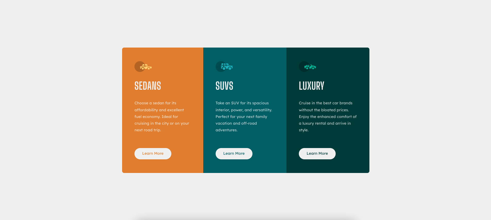

# Frontend Mentor - 3-column preview card component solution

This is a solution to the [3-column preview card component challenge on Frontend Mentor](https://www.frontendmentor.io/challenges/3column-preview-card-component-pH92eAR2-). Frontend Mentor challenges help you improve your coding skills by building realistic projects.

## Table of contents

- [Overview](#overview)
  - [The challenge](#the-challenge)
  - [Screenshot](#screenshot)
  - [Links](#links)
- [My process](#my-process)
  - [Built with](#built-with)
  - [What I learned](#what-i-learned)
- [Author](#author)

## Overview

### The challenge

Users should be able to:

- View the optimal layout depending on their device's screen size
- See hover states for interactive elements

### Screenshot

### Links

- Solution URL: [Github repo](https://github.com/thisisadityarao/FM-3-column-preview-card-component)
- Live Site URL: [Live site](https://thisisadityarao.github.io/FM-3-column-preview-card-component/)

## My process

### Built with

- Semantic HTML5 markup
- CSS custom properties
- Flexbox
- Mobile-first workflow

### What I learned

Applying border on hover over button element was moving the button and it's container slightly, so I found out about applying box-shadow instead of border to the button which gives the same effect without disturbing the layout.

## Author

- Website - [Aditya Rao](https://adityarao.netlify.app/)
- Frontend Mentor - [@thisisadityarao](https://www.frontendmentor.io/profile/thisisadityarao)
- Twitter - [@thisisadityarao](https://www.twitter.com/thisisadityarao)
